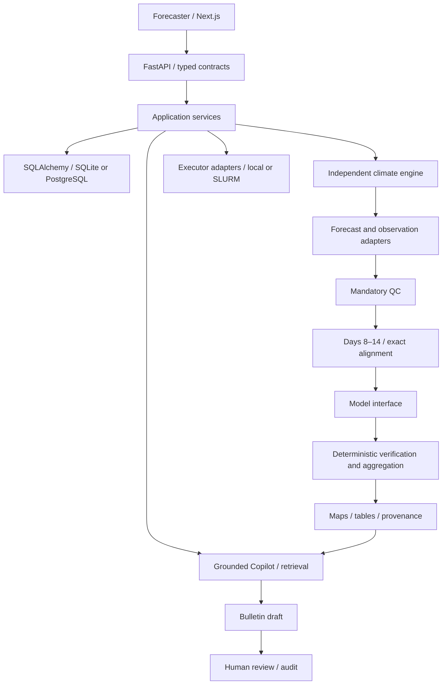

# ICPAC Climate Intelligence & Automation Platform

A modular, CPU-friendly climate-operations prototype: Next.js/TypeScript frontend, FastAPI API, independent xarray scientific engine, and SQLite persistence through SQLAlchemy. **DEMO DATA · SYNTHETIC · NOT FOR OPERATIONAL FORECASTING.** No model artifact, ECMWF credentials, GPU, LLM server or HPC access is required.

## Quick start

Requires Docker Engine and Docker Compose.

```bash
git clone https://github.com/Joe254h/icpac.git
cd icpac
# Until merged, use the implementation branch:
git switch feat/climate-intelligence-prototype
cp .env.example .env
docker compose up --build
```

Frontend: http://localhost:3000 · API: http://localhost:8000 · API documentation: http://localhost:8000/docs. Compose binds ports to localhost. A named volume retains prototype records. No data are automatically published or emailed.

Without Docker, use Python 3.12+ and Node 22+, with pnpm 11:

```bash
python -m venv .venv
# Linux/macOS: source .venv/bin/activate
# PowerShell: .venv\Scripts\Activate.ps1
pip install -e '.[dev]'
python -m uvicorn backend.app.main:app --host 127.0.0.1 --port 8000
# In a second terminal:
cd frontend
corepack enable
pnpm install --frozen-lockfile
pnpm dev
```

## Components and architecture



Directories separate frontend, backend, climate_engine, chatbot, hpc, config, fixtures and deployment. The existing starter file is preserved. Domain configuration includes full Somalia. The production 205,999-cell ICPAC mask is absent and is not reproduced by the demo.

## Development and tests

```bash
ruff format --check backend climate_engine chatbot hpc scripts
ruff check backend climate_engine chatbot hpc scripts
mypy backend climate_engine chatbot hpc
pytest -q
cd frontend
pnpm lint
pnpm typecheck
pnpm test
pnpm build
pnpm exec playwright install chromium
pnpm test:e2e
```

CI runs small deterministic fixtures; it never downloads climate datasets. GitHub Actions checks Python, API, TypeScript, frontend build and a browser workflow. Container validation is separate. The release workflow packages a source archive and does not deploy to ICPAC.

## Configuration and scientific interpretation

Versioned YAML defines variables, units, lead window, domain, resolution, source versions and model feature schemas. Environment variables hold deployment settings; do not commit .env or credentials. Daily precipitation is mm/day. The initialization date is day zero; Days 8–14 are initialization +8 through +14, inclusive. ECMWF fixtures represent daily increments, not running cumulative totals. Real running accumulations need a validated differencing adapter.

Country rainfall means use cosine-latitude area weights. Verification metrics use finite paired spatial cells from one accumulated seven-day forecast. Correlation is spatial pattern correlation, not temporal forecast skill. The cell error map uses single-case absolute error, numerically equivalent to single-case RMSE. Anomalies use a **synthetic reference field**, not historical climatology. Probabilities, SPI and long-term skill are unavailable until scientifically validated inputs exist.

Any country without finite cell centres is reported as unavailable. These values are unavailable; no neighbouring country is substituted. Natural Earth public-domain boundaries are cartographic context, not the authoritative ICPAC operational mask.

## Extending providers

Implement ObservationProvider.load, metadata, list_available_dates and validate. Normalize to precipitation(time, latitude, longitude), mm/day, ascending coordinates and source/version/processing metadata. QC must pass before accumulation and inference. ChirpsProvider, TamsatProvider and RFE2Provider currently supply synthetic fixtures. LocalNetCDFProvider explicitly rejects missing files and unconfigured units; it never falls back to synthetic observations.

ForecastProvider has load(cycle) and metadata. The five prototype sources are ECMWF S2S, IFS, AIFS, GEFS and CFS; all are labelled synthetic. Add retrieval/authentication and provider-specific normalization behind this contract.

## Models and replacement

MockForecastModel and RawECMWFModel share the ForecastModel interface. Native CatBoost/LightGBM/XGBoost and analytical ABC loaders are isolated from frontend/API contracts; other model types require validated adapters. The only available feature schema is rainfall_total_v1 (one aligned accumulated-rainfall feature per cell). **Do not relabel Hybrid7 or Atmos37 artifacts as this schema.** Implement their frozen training-time feature transforms first.

See [exact model registration and replacement instructions](docs/models.md). The registry exposes validated candidates, confirmed promotion and rollback; the frontend automatically reads registered versions. Installing optional model dependencies and mounting an artifact does not rebuild the frontend. Model outputs, provenance and selector metadata remain stable.

## Verification and products

Select model, observation source, cycle and country in the UI. POST /verification/run persists metrics and provenance. GET /analysis returns computed data; GET /export/png, /export/csv and /export/json provide downloads. Example:

```bash
curl -X POST http://localhost:8000/verification/run -H 'Content-Type: application/json' -d '{"model":"mock-v1","observation":"TAMSAT","country":"Kenya"}'
```

## Chatbot, bulletins and HPC

The default interpretation provider is mock, so the application runs without a server. Optional LLM services must use deterministic tool context and grounded output checks. Generated narratives remain drafts. Human review controls bulletin approval and publication; production model promotion requires confirmation and validation. These prototype controls are not substitutes for production authentication and authorization.

See [Copilot and bulletin procedures](docs/chatbot.md), [executor deployment](docs/hpc.md) and [scientific safety](docs/scientific_safety.md). SLURM deployment and real publication/dissemination require an operator integration; they are never triggered merely by asking the chatbot a question.

## Screenshots and validation


[Verification](docs/screenshots/verification.png) · [Models](docs/screenshots/models.png) · [Copilot](docs/screenshots/copilot.png) · [Bulletins](docs/screenshots/bulletins.png) · [Tablet](docs/screenshots/tablet.png)

See [validation scope and limitations](docs/validation.md). Browser acceptance covers observation selection, Copilot tool evidence, bulletin review, actual local execution, and confirmed model promotion/rollback.

## Remaining integrations and roadmap

1. ICPAC authoritative boundaries/mask/grid and operational variable definitions.
2. Licensed forecast retrieval, real CHIRPS/TAMSAT/RFE2 data and latency-aware ingestion events.
3. Frozen Hybrid7/Atmos37 feature builders, trusted final trained artifacts, independent validation and hindcasts.
4. Validated climatology, tercile probabilities, CRPS/Brier/reliability and country/ADM1 verification.
5. Authentication, role-based approvals, immutable audit storage, rate limits and production secrets.
6. ICPAC SLURM partitions, shared storage, Apptainer images and scheduled ingestion.
7. Approved local bulletin archive/SOPs, LLM deployment, Word template and reviewed dissemination.
8. PRECOF/GHACOF, seasonal, early-warning, controlled retraining and monitoring.

The uploaded conversation is context. The pasted build brief defines requested work. Prior conversation claims about model accuracy or operational processing are not treated as measured results in this application.
