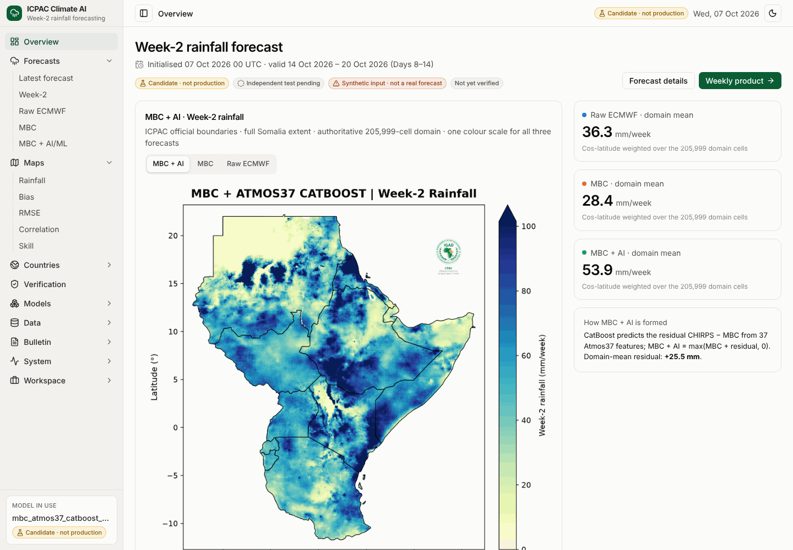

# ICPAC Climate AI · Week-2 rainfall forecasting

Web platform for ICPAC Week-2 (Days 8–14) rainfall forecasts over the eleven member
states. It runs the HPC-validated **MBC + Atmos37 CatBoost** residual model on the
authoritative 800 × 700 grid (205,999-cell ICPAC-11 domain) and shows three forecasts
side by side:

* **Raw ECMWF**: ECMWF S2S ensemble mean of the Week-2 total;
* **MBC**: the locked multiplicative bias correction, `max(0, raw × R[month, cell])`;
* **MBC + AI/ML**: the hybrid residual-corrected forecast,
  `max(MBC + CatBoost residual, 0)`, from 37 rainfall and atmospheric features.

The model in use is the **candidate** `mbc_atmos37_catboost_candidate_v1` (378 trees,
trained 2008–2019, validated 2020–2021). It is not the production model: production
needs a passed independent 2022–2024 test from the HPC and a named reviewer. The refit
arrives as a new version.

| Part | Where |
|---|---|
| Interface (Next.js 16, Tailwind 4, shadcn-style workspace) | `frontend/` |
| API (FastAPI) | `backend/app/` |
| Science: grid, Week-2 processing, MBC, Atmos37 features, inference, verification | `climate_engine/` |
| ICPAC map standard | `climate_engine/cartography/icpac_maps.py` |
| Product packages and bulletin interface | `climate_engine/products/` |
| Verified HPC artifacts (checksummed) | `artifacts/`, `cartography/`, `fixtures/references/` |
| Model descriptors | `config/model_registry/` |

Documentation: [operational models](docs/operational_models.md) ·
[forecast input format](docs/forecast_input_format.md) ·
[deployment (Vercel, Cloud Run, Supabase)](docs/deployment.md) ·
[HPC integration audit](docs/hpc_integration_audit.md) ·
[scientific safety](docs/scientific_safety.md) · [artifacts](artifacts/README.md)

## Run the application

With Docker:

```bash
git clone https://github.com/Joe254h/ICPAC_ML_AI_PRODUCT.git
cd ICPAC_ML_AI_PRODUCT
cp .env.example .env
docker compose up --build
```

Without Docker (Python 3.12+, Node 22+, pnpm 11):

```bash
python -m venv .venv && source .venv/bin/activate   # Windows: .venv\Scripts\Activate.ps1
pip install -e '.[dev]'
python -m scripts.verify_artifacts                    # every HPC artifact against its SHA256
ALLOW_SYNTHETIC_FORECASTS=true python -m uvicorn backend.app.main:app --port 8000
# second terminal
cd frontend && corepack enable && pnpm install --frozen-lockfile && pnpm dev
```

Interface: http://localhost:3000 · API: http://localhost:8000 · API reference:
http://localhost:8000/docs. On startup the API registers the reviewed descriptors in
`config/model_registry/` after verifying every artifact.

## Register the candidate model

Startup does this automatically (`AUTO_REGISTER_MODELS=true`). By hand:

```bash
python -m scripts.register_model \
  --descriptor config/model_registry/mbc_atmos37_catboost_candidate_v1.yaml --actor Joe254h
```

## Run a test forecast

The real model on labelled synthetic ECMWF input (the full chain, no HPC data needed):

```bash
curl -X POST http://localhost:8000/forecasts/run -H 'Content-Type: application/json' \
  -d '{"initialization": "2026-10-05", "source": "synthetic_fixture", "actor": "Joe254h"}'
```

or Data › Forecast runs in the interface. With real ECMWF S2S files in
`FORECAST_INPUT_ROOT`, use `"source": "ecmwf_files"`. Real Atmos37 runs currently stop
at one missing setting, the seven Week-2 pressure-level steps used in training
(`ecmwf.pressure.week2_steps_hours`), which the platform will not guess.

Each run writes a product package to `RUN_ROOT/forecasts/<forecast_id>/` (NetCDF, ICPAC
maps, country statistics, verification, provenance, bulletin inputs). Replacing the
candidate with the refitted model is described in
[operational models](docs/operational_models.md#replacing-the-candidate-with-the-refitted-model).

## API

| Concept | Endpoint |
|---|---|
| Models, model in use, registration | `GET /models`, `GET /models/current`, `POST /models/register` |
| Independent test, promotion | `POST /models/{id}/independent-test`, `POST /models/{id}/promote` |
| Forecasts | `GET /forecasts`, `GET /forecasts/latest`, `POST /forecasts/run`, `POST /forecasts/import` |
| One forecast | `GET /forecasts/{id}`, `/map?layer=hybrid\|mbc\|raw\|residual`, `/countries`, `/verification`, `/bulletin`, `/package/{file}` |
| Verification | `POST /forecasts/{id}/verification`, `GET /verification/seasonal`, `GET /verification/maps/{metric}` |
| System health | `GET /health` |

## Development and tests

```bash
ruff format --check backend climate_engine chatbot hpc scripts
ruff check backend climate_engine chatbot hpc scripts
mypy backend climate_engine chatbot hpc
pytest -q                      # science, artifacts, maps, API, one end-to-end run
cd frontend
pnpm lint && pnpm typecheck && pnpm test && pnpm build
pnpm exec playwright install chromium && pnpm test:e2e
```

Tests use tiny synthetic fixtures plus the committed artifacts; CI never downloads ECMWF or
CHIRPS archives. The end-to-end tests run the real candidate on a synthetic fixture
through the API (`backend/tests/test_end_to_end.py`) and through the interface
(`frontend/e2e/operational.spec.ts`).

## Demonstration workspace

The first release's synthetic 60 × 60 demonstration grid remains under Workspace ›
Demonstration, with the Forecaster Copilot, bulletin drafting with human review and the
pipeline jobs. Everything there is labelled DEMO DATA and is not a forecast.

## Screenshots



[Forecast](docs/screenshots/forecast.png) · [Maps](docs/screenshots/maps.png) ·
[Country](docs/screenshots/country.png) · [Models](docs/screenshots/models.png) ·
[Verification](docs/screenshots/verification.png) · [Weekly product](docs/screenshots/bulletins.png) ·
[Copilot](docs/screenshots/copilot.png) · [Dark](docs/screenshots/dark.png) ·
[Tablet](docs/screenshots/tablet.png). The forecast shown runs the real candidate on
labelled synthetic input.

## Scientific scope

Every number in the interface comes from the API. Anomalies and tercile categories are
reported as unavailable until a climatology and thresholds exist; the Word bulletin waits
for the official template. The 2022–2024 period is the protected independent test: the
platform never fits, tunes or selects models, and forecasts valid in that period are
verified for display only. Open dependencies are listed in
[operational models](docs/operational_models.md#missing-dependencies).
